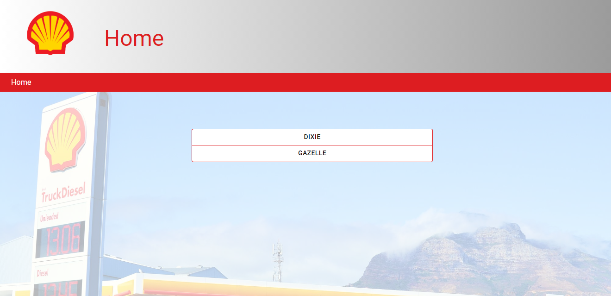
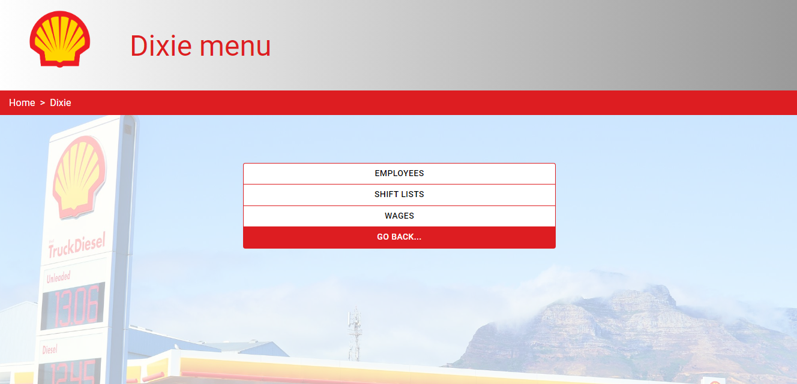
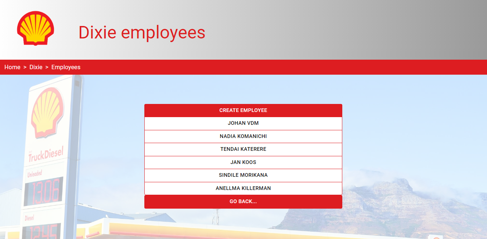
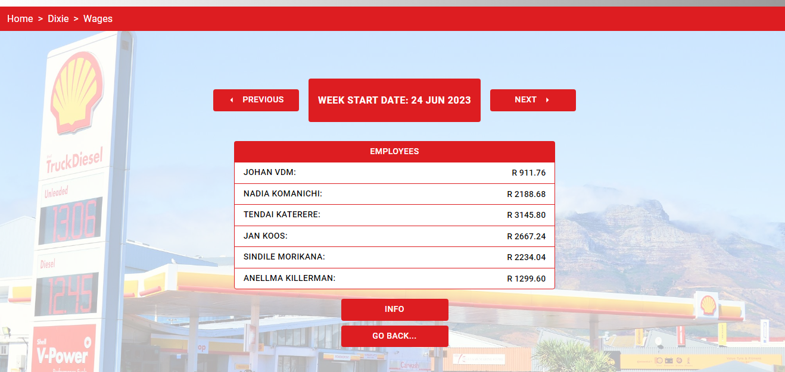

Fuel Station Management Software

This repository contains fuel station management software designed to streamline the operations of a fuel station and simplify employee management. The software provides an intuitive interface to create and manage employees, generate shift lists, and calculate wages efficiently.

Tech stack:

- React.js
- Node.js
- Express.js
- MongoDB

Core functionality:

- Create and manage employees
- Create shift lists by assigning employees to shifts.
- View the wages per week based on the shift lists created. 

The client has two fuel stations, thus the app and database is split in to two parts. 
On the home screen you can select the fuel station you want to work with. 

Once a fuel station has been selected, the main menu is displayed.
From here you can select whether you want to go to the employees page, shift lists page, or the wages pages.

Employees page:

On the employees page, you can view the current employees or create new employees.
The employees and their relevant information is stored in a MongoDB database.  

Shift list page: 

On the shift list page the created shift lists are displayed. 
You can select from the current created employees to assign them to shifts
The shift lists are stored in a MongoDB database.

Wages page: 

On the wages page you can see the calculated wages of each employee for the relevant shift list. 

